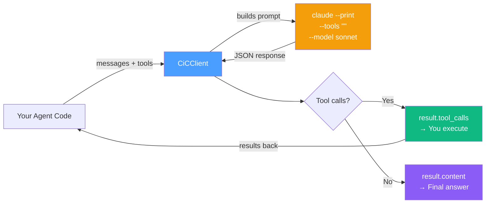
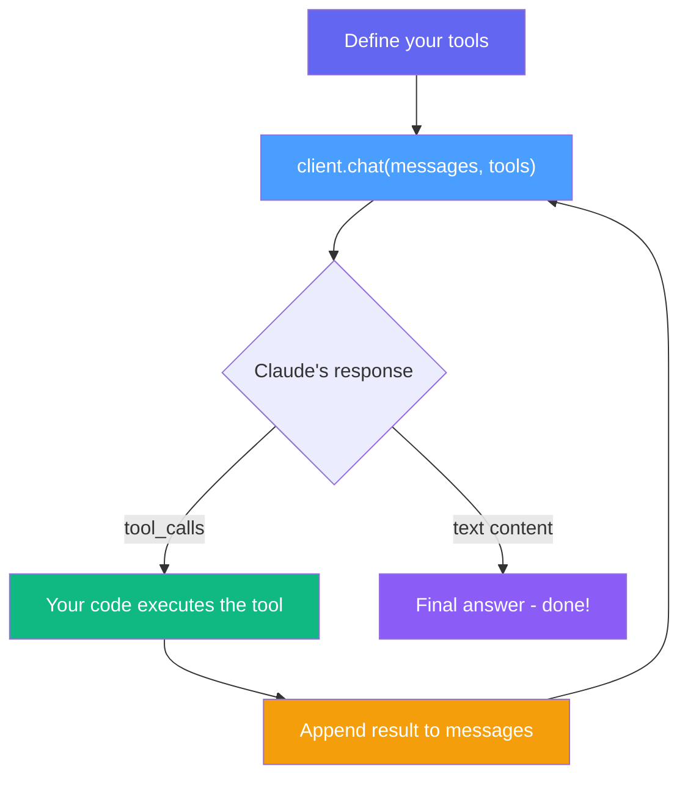
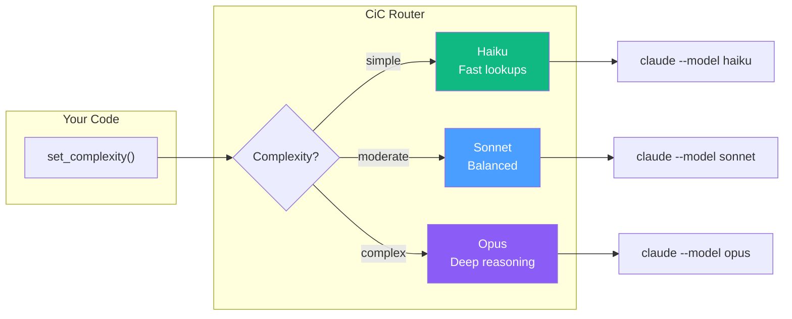
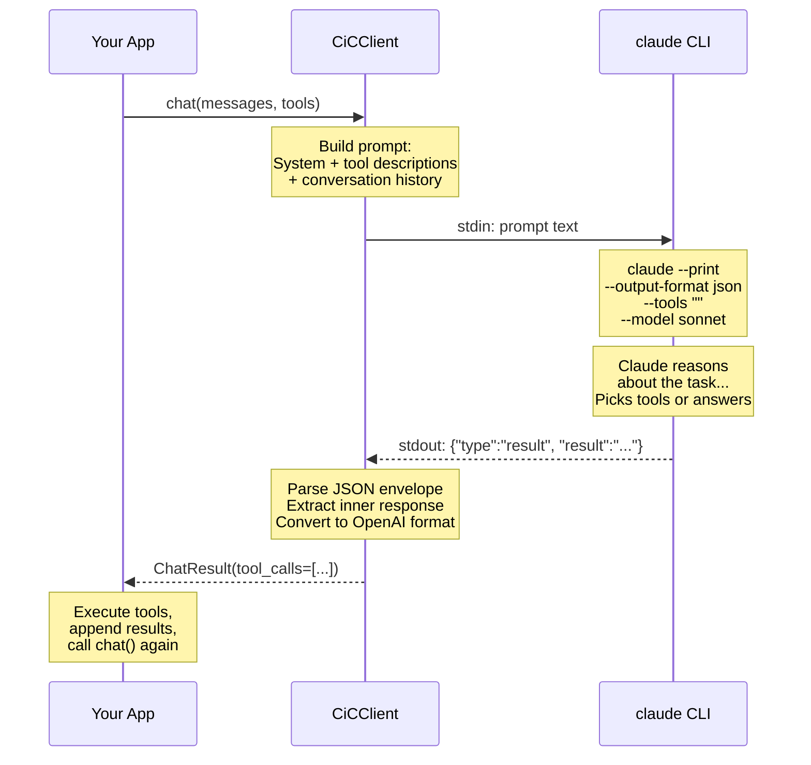
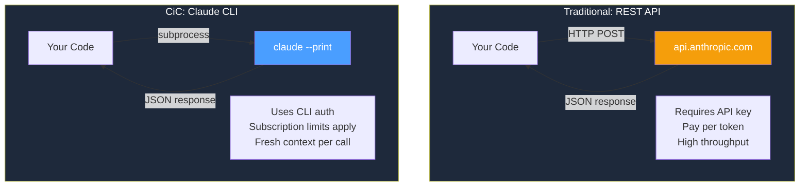

# CiC — Context in Claude Code

**Build your own personal AI agent using the Claude Code CLI as a subprocess.**

CiC lets you use `claude` as the brain of your agent while you control the body. You define the tools (read files, query APIs, run commands — anything). Claude decides which tools to call. Your code executes them. That's it.

No SDK lock-in. No framework to learn. Just a subprocess, a JSON protocol, and your agent logic.

---

## What CiC Does



**Key insight:** Claude Code's built-in tools are disabled (`--tools ""`). Claude only *decides* which of **your** tools to call. **You** execute them. You stay in full control.

---

## The Agent Loop

This is the core pattern CiC enables:



```python
from cic import CiCClient

client = CiCClient(model="sonnet")
messages = [{"role": "user", "content": "Read config.yaml and summarize it"}]

while True:
    result = client.chat(messages, tools=my_tools)

    if not result.has_tool_calls:
        print("Done:", result.content)
        break

    # Claude decided — now YOU execute
    for tc in result.tool_calls:
        output = execute_tool(tc.name, tc.arguments)
        messages.append({"role": "tool", "tool_call_id": tc.id, "content": output})
```

---

## Smart Routing

Different tasks need different models. CiC routes automatically based on complexity:



```python
client = CiCClient(routing={
    "simple":   "haiku",
    "moderate": "sonnet",
    "complex":  "opus",
})

client.set_complexity("simple")
result = client.chat(messages)   # Uses Haiku

client.set_complexity("complex")
result = client.chat(messages)   # Uses Opus
```

---

## How It Works Under the Hood



Each call is a **fresh subprocess** — no state leaks between calls. Your agent code maintains the conversation history in `messages[]` and passes it each time.

**Under the hood, CiC handles four sharp edges automatically:**

- **Context bloat prevention** — `--setting-sources user` + `--system-prompt ""` reduces cache creation from ~45K to ~3K tokens per call (13x reduction).
- **MCP isolation** — `--strict-mcp-config` strips all MCP tools (e.g. Google Calendar) that would confuse the model into thinking those are its only tools.
- **Nesting safety** — Strips `CLAUDECODE` and `CLAUDE_CODE_ENTRY_POINT` env vars so CiC works even when called from inside a Claude Code session (hooks, skills, agent-in-agent).
- **Dynamic tool scoping** — After 3 read-type tool calls (file_read, content_search, etc.), read tools are stripped from the prompt. The model can only edit, write, or finish. This prevents the "read forever, never edit" loop that occurs when models have both read and edit tools available via text descriptions.

---

## Comparing Approaches



CiC is for developers building tools and agents on top of Claude Code. For production workloads with high throughput requirements, use the [Anthropic API](https://docs.anthropic.com/) directly.

---

## Quick Start

### Install

```bash
git clone https://github.com/maclarensg/CiC
cd CiC
pip install -e .
```

**Prerequisite:** [Claude Code CLI](https://docs.anthropic.com/en/docs/claude-code) installed and authenticated.

```bash
npm install -g @anthropic-ai/claude-code
claude  # authenticate on first run
```

### Basic chat

```python
from cic import CiCClient

client = CiCClient(model="sonnet")
result = client.chat([{"role": "user", "content": "What is the capital of France?"}])
print(result.content)
```

### Async

```python
import asyncio
from cic import CiCClient

async def main():
    client = CiCClient(model="sonnet")
    result = await client.achat([{"role": "user", "content": "Hello async!"}])
    print(result.content)

asyncio.run(main())
```

### Tool use agent

```python
from cic import CiCClient

tools = [
    {
        "name": "read_file",
        "description": "Read a file from disk.",
        "parameters": {
            "type": "object",
            "properties": {"path": {"type": "string"}},
            "required": ["path"],
        },
    }
]

client = CiCClient(model="sonnet")
messages = [{"role": "user", "content": "Read /etc/hostname and tell me what it says."}]

while True:
    result = client.chat(messages, tools=tools)

    if not result.has_tool_calls:
        print("Answer:", result.content)
        break

    messages.append({
        "role": "assistant", "content": None,
        "tool_calls": [
            {"id": tc.id, "type": "function",
             "function": {"name": tc.name, "arguments": tc.arguments_json()}}
            for tc in result.tool_calls
        ],
    })

    for tc in result.tool_calls:
        with open(tc.arguments["path"]) as f:
            output = f.read()
        messages.append({"role": "tool", "tool_call_id": tc.id, "name": tc.name, "content": output})
```

---

## OpenAI Drop-In Compatibility

```python
response = client.chat_openai_format(messages, tools=tools)

# Same structure as OpenAI responses:
response["choices"][0]["message"]["content"]
response["choices"][0]["message"]["tool_calls"]
response["choices"][0]["finish_reason"]
```

---

## API Reference

### `CiCClient`

```python
CiCClient(
    model: str | None = None,               # Fixed model ("sonnet", "opus", "haiku")
    routing: dict[str, str] | None = None,   # Complexity -> model map
    timeout: float = 120.0,                  # Subprocess timeout (seconds)
    claude_path: str | None = None,          # Path to claude binary
)
```

| Method | Description |
|--------|-------------|
| `chat(messages, *, tools=None) -> ChatResult` | Synchronous chat |
| `achat(messages, *, tools=None) -> ChatResult` | Async chat |
| `chat_openai_format(messages, *, tools=None) -> dict` | Returns OpenAI-compatible dict |
| `set_complexity(level: str)` | Set complexity for smart routing |
| `set_model(model: str)` | Override model for next call |
| `active_model -> str` | Property: model that will be used |

### `ChatResult`

| Field | Type | Description |
|-------|------|-------------|
| `content` | `str \| None` | Text response (None if tool calls) |
| `tool_calls` | `list[ToolCall]` | Tool call decisions |
| `has_tool_calls` | `bool` | True if tool_calls is non-empty |
| `model` | `str` | Model used (e.g. `"cic/sonnet"`) |
| `usage` | `TokenUsage` | Estimated token usage |
| `raw` | `dict` | Raw OpenAI-format dict |

### `ToolCall`

| Field | Type | Description |
|-------|------|-------------|
| `id` | `str` | Call ID (e.g. `"call_1"`) |
| `name` | `str` | Tool name |
| `arguments` | `dict` | Parsed arguments |
| `arguments_json()` | `str` | Arguments as JSON string |

### Exceptions

| Exception | When |
|-----------|------|
| `ClaudeNotFoundError` | `claude` CLI not in PATH |
| `ClaudeTimeoutError` | Subprocess exceeded timeout |
| `ClaudeSubprocessError` | CLI returned an error |
| `ResponseParseError` | Could not parse response JSON |

---

## Limitations

- **No streaming** — each call waits for the full response
- **~1-2s overhead per call** — subprocess spawn time
- **Token estimates only** — usage is approximated (chars / 4)
- **Subscription limits apply** — your Claude plan's limits are unchanged; CiC does not modify, bypass, or circumvent any usage policies

---

## Important: Usage Terms

CiC uses the official `claude` CLI binary and respects Anthropic's authentication. It does **not** extract, proxy, or redistribute OAuth tokens.

Users are responsible for complying with [Anthropic's Consumer Terms of Service](https://www.anthropic.com/legal/consumer-terms) and the [Claude Code usage policies](https://code.claude.com/docs/en/legal-and-compliance):

- **Subscription limits apply.** Rolling usage windows are unchanged.
- **Individual use.** Do not pool, share, or resell subscription access.
- **For production/high-throughput**, consider the [Anthropic API](https://docs.anthropic.com/) with API key authentication.

---

## Development

```bash
pip install -e ".[dev]"
PYTHONPATH=src pytest -v
```

---

## License

MIT — see [LICENSE](LICENSE).

---

*CiC is an independent open-source project, not affiliated with or endorsed by Anthropic. "Claude" and "Claude Code" are trademarks of Anthropic, PBC.*
