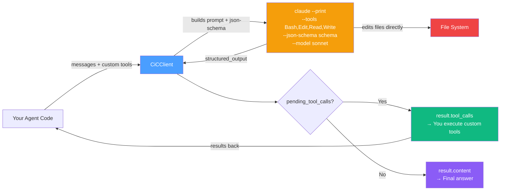
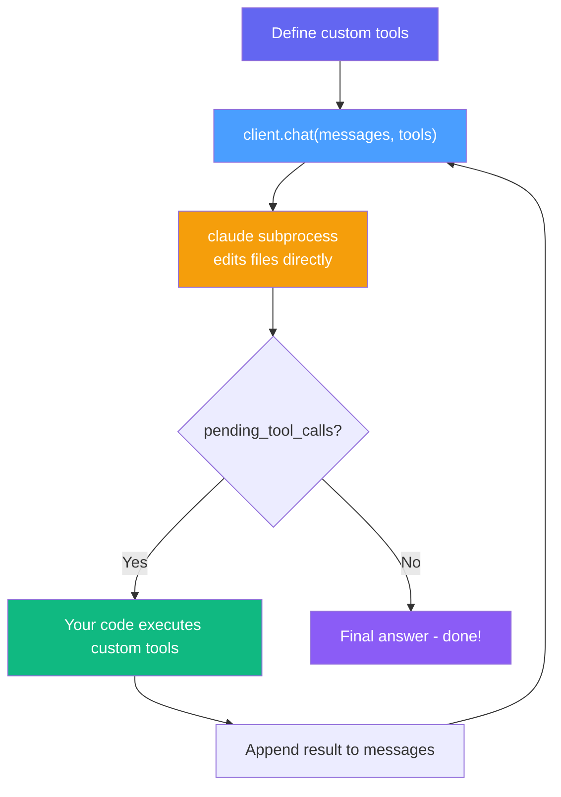
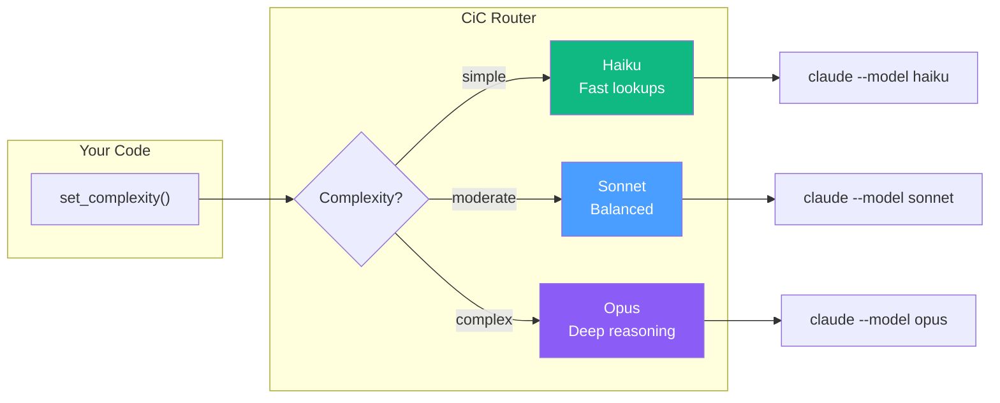
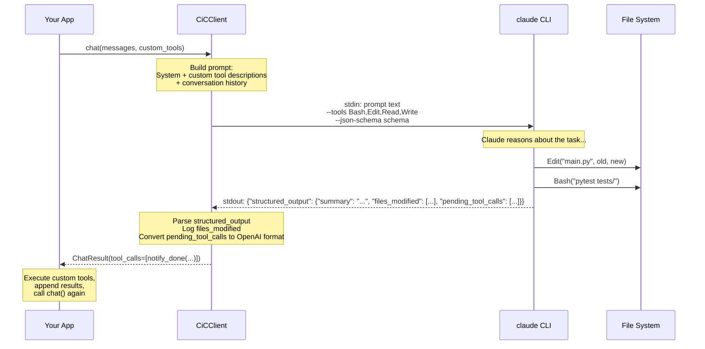
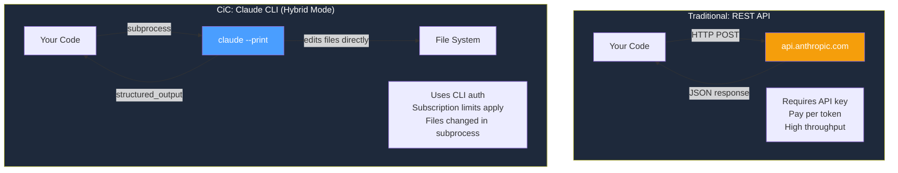

# CiC — Context in Claude Code

**Build your own personal AI agent using the Claude Code CLI as a subprocess.**

CiC lets you use `claude` as the brain of your agent while you control the body. You define the tools. Claude decides which ones to call. Your code executes them. That's it.

Two modes let you choose how much control to keep:
- **Hybrid mode** (default) — Claude edits files itself, you only execute custom tools
- **Non-hybrid mode** — Claude decides every action, you execute everything (including file ops)

No SDK lock-in. No framework to learn. Just a subprocess, structured output, and your agent logic.

---

## Hybrid vs Non-Hybrid Mode

| | Hybrid (default) | Non-Hybrid (`hybrid=False`) |
|---|---|---|
| Claude's built-in tools | Yes (Bash, Edit, Read, Write) | No tools |
| File edits | Claude edits files directly | Caller executes every edit |
| Actions per call | Many (Claude loops internally) | One action per call |
| Caller executes | Custom tools only | ALL tools (file ops, shell, custom) |
| Control | Less — Claude decides when to stop | Full — you verify every operation |
| Round-trips | Fewer | More |

**When to use hybrid:** You want Claude to handle file operations autonomously. Fewer lines of agent loop code. Less round-trip overhead.

**When to use non-hybrid:** You want to verify or intercept every file change before it happens. Useful when you need an audit trail, want to run safety checks on edits, or are building a tool where user approval is required.

---

## How Hybrid Mode Works

CiC uses **hybrid mode**: Claude keeps its built-in file tools (`Bash`, `Edit`, `Read`, `Write`) and edits files ITSELF inside the subprocess. Custom tools you define are returned via `--json-schema` structured output and executed by your agent loop.



**The key insight:** Claude edits files ITSELF. Your code only executes custom tools (database updates, kanban moves, API calls — things Claude can't do natively). This eliminates the phantom edit bug.

---

## How Non-Hybrid Mode Works

Non-hybrid mode gives you full control over every tool execution. Claude has no built-in tools — it outputs **one action per call** and the caller executes it.

The breakthrough that makes this work: `--json-schema` with an action-enum schema forces Claude to output structured tool call decisions instead of narrative text. Every response is exactly one JSON object with `action`, `arguments`, and `reasoning`.

```mermaid
flowchart LR
    A[Your Agent Code] -->|messages + all tools| B[CiCClient\nhybrid=False]
    B -->|builds prompt + action-enum schema| C["claude --print\n--tools ''\n--json-schema schema\n--model sonnet"]
    C -->|structured_output\n{action, arguments, reasoning}| B
    B --> D{action?}
    D -->|tool_call| E["result.tool_calls\n→ You execute the tool"]
    D -->|done| F["result.content\n→ Task complete"]
    D -->|blocked| G["result.content\n→ Blocked reason"]
    E -->|result appended| A
    A -->|next chat\| B

    style B fill:#4a9eff,color:#fff
    style C fill:#f59e0b,color:#fff
    style E fill:#10b981,color:#fff
    style F fill:#8b5cf6,color:#fff
```

```python
from cic import CiCClient

# Define ALL tools — Claude cannot call any of them directly
tools = [
    {
        "name": "file_read",
        "description": "Read a file from disk.",
        "parameters": {
            "type": "object",
            "properties": {"path": {"type": "string"}},
            "required": ["path"],
        },
    },
    {
        "name": "file_edit",
        "description": "Edit a file by replacing old_string with new_string.",
        "parameters": {
            "type": "object",
            "properties": {
                "path": {"type": "string"},
                "old_string": {"type": "string"},
                "new_string": {"type": "string"},
            },
            "required": ["path", "old_string", "new_string"],
        },
    },
    {
        "name": "shell_exec",
        "description": "Run a shell command.",
        "parameters": {
            "type": "object",
            "properties": {"command": {"type": "string"}},
            "required": ["command"],
        },
    },
]

client = CiCClient(model="sonnet", hybrid=False)
messages = [{"role": "user", "content": "Fix the bug in main.py on line 42"}]

while True:
    result = client.chat(messages, tools=tools)

    if not result.has_tool_calls:
        # action was "done" or "blocked" — we're finished
        print("Done:", result.content)
        break

    # Claude decided one action — YOU execute it
    for tc in result.tool_calls:
        if tc.name == "file_read":
            output = open(tc.arguments["path"]).read()
        elif tc.name == "file_edit":
            # You can inspect or approve the edit before applying it
            apply_edit(tc.arguments["path"], tc.arguments["old_string"], tc.arguments["new_string"])
            output = "Edit applied"
        elif tc.name == "shell_exec":
            output = subprocess.check_output(tc.arguments["command"], shell=True, text=True)
        else:
            output = f"Unknown tool: {tc.name}"

        messages.append({"role": "assistant", "content": None, "tool_calls": [
            {"id": tc.id, "type": "function", "function": {"name": tc.name, "arguments": tc.arguments_json()}}
        ]})
        messages.append({"role": "tool", "tool_call_id": tc.id, "name": tc.name, "content": output})
```

Each call returns exactly one action. The loop continues until Claude outputs `action: "done"` (no tool calls) or `action: "blocked"` (also no tool calls, with a reason in `result.content`).

---

## The Phantom Edit Bug (What We Fixed)

The old approach (`--tools ""`) disabled ALL of Claude's built-in tools. Claude had to describe file edits as tool calls in narrative JSON, which the framework then executed. This broke in practice:

1. Claude sometimes returned tool calls embedded in narrative text (never parsed)
2. Claude sometimes described what it would do without actually calling the tool
3. Tasks were falsely marked as complete because the agent loop exited on `"response": "..."` even though no files were changed

**Hybrid mode fixes this:** Claude just uses `Edit` or `Write` directly. The files change. The structured output confirms what changed. No ambiguity.

```
OLD (broken):                          NEW (hybrid):
claude --tools ""                      claude --tools "Bash,Edit,Read,Write"
                                             --json-schema schema

Claude returns:                        Claude does:
{"tool_calls": [{"name":               1. Reads the file with Read tool
  "file_edit", "arguments":            2. Edits with Edit tool (file changes NOW)
  {"path": "...", "old": "..."}}]}     3. Returns structured output:
                                          {"summary": "Fixed the bug",
Your code runs the edit.                   "files_modified": ["/path/to/file.py"],
                                           "pending_tool_calls": [
Sometimes Claude wrote text                {"name": "notify_done", ...}]}
instead of JSON. Edit never ran.
Card moved to done. Bug unfixed.
```

---

## The Agent Loop



```python
from cic import CiCClient

# Only define custom tools — file tools are handled by Claude natively
custom_tools = [
    {
        "name": "notify_done",
        "description": "Send a notification when the task is complete.",
        "parameters": {
            "type": "object",
            "properties": {"message": {"type": "string"}},
            "required": ["message"],
        },
    }
]

client = CiCClient(model="sonnet")
messages = [{"role": "user", "content": "Fix the bug in main.py line 42"}]

while True:
    result = client.chat(messages, tools=custom_tools)

    if not result.has_tool_calls:
        print("Done:", result.content)
        break

    # Claude decided to call a custom tool — now YOU execute it
    for tc in result.tool_calls:
        output = execute_tool(tc.name, tc.arguments)
        messages.append({"role": "tool", "tool_call_id": tc.id, "content": output})
```

Claude handles `Read`, `Edit`, `Bash` itself. You only execute `notify_done`.

---

## Smart Routing

Different tasks need different models. CiC routes automatically based on complexity:



```python
client = CiCClient(routing={
    "simple":   "haiku",
    "moderate": "sonnet",
    "complex":  "opus",
})

client.set_complexity("simple")
result = client.chat(messages)   # Uses Haiku

client.set_complexity("complex")
result = client.chat(messages)   # Uses Opus
```

---

## How It Works Under the Hood



Each call is a **fresh subprocess** — no state leaks between calls. Your agent code maintains the conversation history in `messages[]` and passes it each time.

**CiC handles several sharp edges automatically:**

- **File edits happen in the subprocess.** No phantom edits. Files change before structured output is returned.
- **Idle timeout, not wall timeout** — CiC uses `--output-format stream-json` and reads stdout line-by-line. The `timeout` parameter is an *idle* timeout: the process is only killed if no output is received for that many seconds. Claude can run multi-step tasks as long as it keeps producing output (tool calls, edits, thinking). The guard only fires on genuine stalls.
- **Context bloat prevention** — `--setting-sources user` + `--system-prompt` reduces cache creation from ~45K to ~3K tokens per call (13x reduction).
- **MCP isolation** — `--strict-mcp-config` strips all MCP tools (e.g. Google Calendar) that would confuse the model.
- **Nesting safety** — Strips `CLAUDECODE` and `CLAUDE_CODE_ENTRY_POINT` env vars so CiC works even when called from inside a Claude Code session (hooks, skills, agent-in-agent).
- **Native tool filtering** — File/shell tools in your `tools` list are automatically stripped from the prompt description since Claude handles them natively.

---

## Comparing Approaches



CiC is for developers building tools and agents on top of Claude Code. For production workloads with high throughput requirements, use the [Anthropic API](https://docs.anthropic.com/) directly.

---

## Quick Start

### Install

```bash
git clone https://github.com/maclarensg/CiC
cd CiC
pip install -e .
```

**Prerequisite:** [Claude Code CLI](https://docs.anthropic.com/en/docs/claude-code) installed and authenticated.

```bash
npm install -g @anthropic-ai/claude-code
claude  # authenticate on first run
```

### Basic chat

```python
from cic import CiCClient

client = CiCClient(model="sonnet")
result = client.chat([{"role": "user", "content": "What is the capital of France?"}])
print(result.content)
```

### Async

```python
import asyncio
from cic import CiCClient

async def main():
    client = CiCClient(model="sonnet")
    result = await client.achat([{"role": "user", "content": "Hello async!"}])
    print(result.content)

asyncio.run(main())
```

### Agent with custom tools

```python
from cic import CiCClient

# Only define custom tools — Claude handles file operations natively
custom_tools = [
    {
        "name": "update_database",
        "description": "Update a record in the database after code changes.",
        "parameters": {
            "type": "object",
            "properties": {
                "table": {"type": "string"},
                "record_id": {"type": "string"},
                "status": {"type": "string"},
            },
            "required": ["table", "record_id", "status"],
        },
    }
]

client = CiCClient(model="sonnet")
messages = [{"role": "user", "content": "Fix the validation bug in user.py and mark task T-42 as done."}]

while True:
    result = client.chat(messages, tools=custom_tools)

    if not result.has_tool_calls:
        print("Done:", result.content)
        break

    # Only custom tools come back here — file edits already happened
    for tc in result.tool_calls:
        if tc.name == "update_database":
            db.update(tc.arguments["table"], tc.arguments["record_id"], tc.arguments["status"])
            output = f"Updated {tc.arguments['table']} record {tc.arguments['record_id']}"
        messages.append({"role": "tool", "tool_call_id": tc.id, "name": tc.name, "content": output})
```

---

## Structured Output Format

When using hybrid mode, Claude returns a structured response with these fields:

| Field | Type | Description |
|-------|------|-------------|
| `summary` | `string` | What Claude did — files changed, commands run, outcomes |
| `files_modified` | `string[]` | Absolute paths of files Claude created or modified |
| `pending_tool_calls` | `object[]` | Custom tools to execute (name + arguments) |
| `test_results` | `string` (optional) | Test output if tests were run |
| `blocked` | `string` (optional) | Why Claude could not complete the task |

CiC converts `pending_tool_calls` to OpenAI `tool_calls` format automatically, so `result.tool_calls` works the same as before.

---

## OpenAI Drop-In Compatibility

```python
response = client.chat_openai_format(messages, tools=tools)

# Same structure as OpenAI responses:
response["choices"][0]["message"]["content"]
response["choices"][0]["message"]["tool_calls"]
response["choices"][0]["finish_reason"]
```

---

## API Reference

### `CiCClient`

```python
CiCClient(
    model: str | None = None,               # Fixed model ("sonnet", "opus", "haiku")
    routing: dict[str, str] | None = None,  # Complexity -> model map
    timeout: float = 120.0,                 # Subprocess timeout (seconds)
    claude_path: str | None = None,         # Path to claude binary
    hybrid: bool = True,                    # True: Claude edits files directly
                                            # False: caller executes every tool
)
```

| Method | Description |
|--------|-------------|
| `chat(messages, *, tools=None) -> ChatResult` | Synchronous chat |
| `achat(messages, *, tools=None) -> ChatResult` | Async chat |
| `chat_openai_format(messages, *, tools=None) -> dict` | Returns OpenAI-compatible dict |
| `set_complexity(level: str)` | Set complexity for smart routing |
| `set_model(model: str)` | Override model for next call |
| `active_model -> str` | Property: model that will be used |

### `ChatResult`

| Field | Type | Description |
|-------|------|-------------|
| `content` | `str \| None` | Text response (None if tool calls) |
| `tool_calls` | `list[ToolCall]` | Custom tool call decisions |
| `has_tool_calls` | `bool` | True if tool_calls is non-empty |
| `model` | `str` | Model used (e.g. `"cic/sonnet"`) |
| `usage` | `TokenUsage` | Estimated token usage |
| `raw` | `dict` | Raw OpenAI-format dict |

### `ToolCall`

| Field | Type | Description |
|-------|------|-------------|
| `id` | `str` | Call ID (e.g. `"call_1"`) |
| `name` | `str` | Tool name |
| `arguments` | `dict` | Parsed arguments |
| `arguments_json()` | `str` | Arguments as JSON string |

### Exceptions

| Exception | When |
|-----------|------|
| `ClaudeNotFoundError` | `claude` CLI not in PATH |
| `ClaudeTimeoutError` | Subprocess exceeded timeout |
| `ClaudeSubprocessError` | CLI returned an error |
| `ResponseParseError` | Could not parse response JSON |

---

## Limitations

- **No streaming** — each call waits for the full response
- **~1-2s overhead per call** — subprocess spawn time
- **Token estimates only** — usage is approximated (chars / 4)
- **Subscription limits apply** — your Claude plan's limits are unchanged; CiC does not modify, bypass, or circumvent any usage policies

---

## Important: Usage Terms

CiC uses the official `claude` CLI binary and respects Anthropic's authentication. It does **not** extract, proxy, or redistribute OAuth tokens.

Users are responsible for complying with [Anthropic's Consumer Terms of Service](https://www.anthropic.com/legal/consumer-terms) and the [Claude Code usage policies](https://code.claude.com/docs/en/legal-and-compliance):

- **Subscription limits apply.** Rolling usage windows are unchanged.
- **Individual use.** Do not pool, share, or resell subscription access.
- **For production/high-throughput**, consider the [Anthropic API](https://docs.anthropic.com/) with API key authentication.

---

## Development

```bash
pip install -e ".[dev]"
PYTHONPATH=src pytest -v
```

---

## License

MIT — see [LICENSE](LICENSE).

---

*CiC is an independent open-source project, not affiliated with or endorsed by Anthropic. "Claude" and "Claude Code" are trademarks of Anthropic, PBC.*
